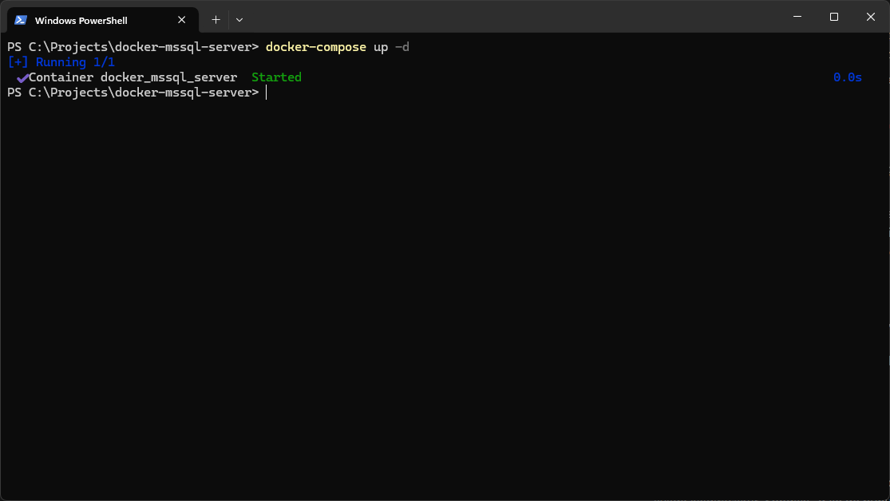
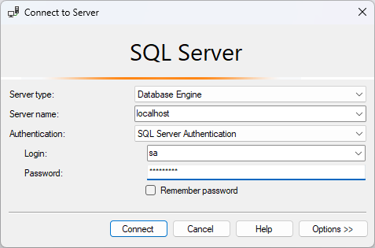

# Docker Kurulumu

Öncelikle bilgisayarımıza [bu adresten](https://www.docker.com/products/docker-desktop/) Docker Desktop’ı kurmamız gerekiyor. Kurulumu yaptıktan sonra terminale aşağıdaki komut ile kontrol edelim. Eğer çıktı alıyorsak kurulum başarılıdır diyebiliriz.

```bash
docker --version
```

---

# MSSQL Image Kurulumu

Ardından kullanacağımız image’i indirmemiz gerekiyor. Bunun içinde aşağıdaki komutu terminalden çalıştırıyoruz.

```bash
docker pull mcr.microsoft.com/mssql/server:2022-latest
```

---

# Docker Compose Dosyasının Hazırlanması

Sonrasında docker üzerinden SQL Server’ı çalıştıracağımız bir klasöre ihtiyacımız var. Bu klasör içerisinde `docker-compose.yml` dosyamız ve verilerimizin kalıcı olması için gereken dosyaları barındıracak.

```bash
mkdir docker-mssql-server && cd docker-mssql-server
```

Sonrasında bu klasör içerisinde `docker-compose.yml` dosyasını oluşturup içerisine aşağıdaki satırları ekliyoruz.

```yaml
version: '3.8'

services:
  mssql:
    image: mcr.microsoft.com/mssql/server:2022-latest
    container_name: docker_mssql_server
    ports:
      - '1433:1433'
    environment:
      SA_PASSWORD: 'Admin1234'
      ACCEPT_EULA: 'Y'
    volumes:
      - ./data:/var/opt/mssql/data
      - ./log:/var/opt/mssql/log
      - ./secrets:/var/opt/mssql/secrets
```

Burada kullanacağımız image’ı belirtiyoruz, yukarıda `docker pull` komutu ile indirdiğimiz image’in aynısı. Siz farklı bir sürümünü indirdiyseniz buraya indirdiğiniz image adını vermeniz gerekiyor.

`container_name` alanı ise istediğiniz ismi verdiğiniz alan, bu image ile oluşturulacak container’ın ismini belirtiyoruz.

Ardından hangi port üzerinden bu container’a erişeceğimizi belirtiyoruz, 1433 MSSQL için varsayılan port numarası olarak geliyor.

Sonrasında ise sa isimli admin kullanıcısı için bir şifre giriyoruz, veri tabanına bağlanırken bu şifre ile giriş yapacağız.

Son kısımda ise container’ı durdurduktan sonra tekrar çalıştırdığımızda, veri tabanı üzerinde yaptığımız değişikliklerin kaybolmaması için bu verileri saklayacağımız dizinleri belirtiyoruz. Benim verdiğim örnekte `docker-compose.yml` dosyasını oluşturuduğumuz dizine belirtildiği şekilde klasörleri oluşturacaktır.

# Container’ın Çalıştırılması

`docker-compose.yml` dosyasını oluşturup kaydettikten sonra ilgili dizinde terminali açıyoruz. Ardından aşağıdaki komutu çalıştırıyoruz.

```bash
docker-compose up -d
```

Yukarıdaki komut ilgili `docker-compose` dosyasına göre belirtilen image’lar üzerinden container’ları ayağa kaldıracaktır. Sondaki `-d` ile de bunu arka planda yapmasını söylemiş oluyoruz. Eğer herşey doğru yapıldıysa aşağıdaki gibi bir terminal ekranı sizi karşılayacaktır.



# Veri Tabanına Bağlanmak

Docker üzerinden ayağa kaldırdığımız veri tabanımız artık kullanıma hazır. Bu veri tabanına bağlanmak için istediğiniz aracı kullanabilirsiniz. Bende hali hazırda yüklü olan SQL Server Management Studio’yu kullanacağım.

Bağlantıyı aşağıdaki görseldeki gibi kurduğumuzda başarılı şekilde veri tabanına bağlandığınızı göreceksiniz.



---

Evet, bu yazının sonuna geldik. Şimdiye kadar kaleme aldığım ilk yazım oluyor, umarım faydalı olabilmişimdir. Mümkün olduğu kadar en basit şekilde çözüme yönelik olarak anlatmaya çalıştım.

Değerli görüşlerinizi eksik etmeyin, sağlıkla kalın.
